# RML Intranet - Platform Feature Map

**Platform:** Roaming Around (intranet.roammigrationlaw.com)
**Stack:** React Router v7, Vite, Tailwind v4, Notion API, Metabase
**Last Updated:** 2026-02-26
**Repo:** `/tmp/Rmlintranetdesign`

---

## Platform Purpose

The RML Intranet is the operational hub for Roam Migration Law staff. It serves three primary functions:

1. **Operations Management** — leave, team timelines, IT support, facilities, task tracking
2. **Reporting & Business Intelligence** — KPI dashboards, fee reporting, SLA tracking, CPD/training
3. **Transparency & Communication** — daily pulse, critical updates, policies, position descriptions

The platform is role-aware (5 roles: `legal-staff`, `operations`, `hr`, `admin`, `team-leader`) and integrates Notion as a CMS/backend and Metabase for embedded analytics.

---

## Information Architecture

```mermaid
graph TD
  Home["/ — Home (Daily Pulse)"]

  Home --> LH["/legal-hub — Legal Hub"]
  Home --> PP["/people — People & Culture"]
  Home --> CO["/core-operations — Core Operations"]
  Home --> TC["/training-competency — Training & Competency"]
  Home --> SM["/sales-marketing — Sales & Marketing"]
  Home --> FIN["/finance — Finance"]
  Home --> BI["/business-intelligence — Business Intelligence"]
  Home --> ADM["/admin — Admin"]

  LH --> LH1["SOPs (Roam Standard, BAL)"]
  LH --> LH2["Fees & Pricing"]
  LH --> LH3["Legal Precedents"]
  LH --> LH4["Application Checklists"]
  LH --> LH5["Documentation Library"]
  LH --> LH6["Actionstep Access"]

  PP --> PP1["Position Descriptions (Notion)"]
  PP --> PP2["Leave Management"]
  PP --> PP3["Policies & Handbook"]
  PP --> PP4["Wellbeing Resources"]
  PP --> PP5["Professional Development"]

  CO --> CO1["IT Support"]
  CO --> CO2["Documentation"]
  CO --> CO3["Process Management"]
  CO --> CO4["Facilities"]
  CO --> CO5["Team Updates"]

  TC --> TC1["Training Sessions"]
  TC --> TC2["CPD Tracking"]

  SM --> SM1["Sales Initiatives"]
  SM --> SM2["Marketing Content"]

  FIN --> FIN1["Financial Reports"]
  FIN --> FIN2["Budgets"]

  BI --> BI1["SPQR Dashboard (Metabase)"]
  BI --> BI2["Executive Dashboard"]
  BI --> BI3["Team Leader Dashboard"]
  BI --> BI4["KPI Submissions (Notion)"]
  BI --> BI5["/kpi — Weekly KPI Form"]

  ADM --> ADM1["User Management"]
  ADM --> ADM2["Admin Dashboard"]

  classDef functional fill:#2d6a2d,color:#fff
  classDef partial fill:#7a6a00,color:#fff
  classDef stub fill:#6a2222,color:#fff

  class Home,PP1,BI1,BI4,BI5 functional
  class LH,LH5,LH6,BI2,BI3,ADM1,ADM2 partial
  class PP2,PP3,PP4,PP5,LH1,LH2,LH3,LH4,CO,CO1,CO2,CO3,CO4,CO5,TC,TC1,TC2,SM,SM1,SM2,FIN,FIN1,FIN2 stub
```



---

## Feature Status Matrix

### Legend
| Status | Meaning |
|--------|---------|
| **Functional** | Real data, real logic, usable in production |
| **Partial** | UI exists; some real data or real links, but incomplete or placeholder content |
| **Stub** | Route/nav exists; page renders but all content is static placeholder |
| **Planned** | Not yet built; identified as needed |

---

### Home (`/`)

| Feature | Status | Data Source | Notes |
|---------|--------|-------------|-------|
| Daily Priorities | **Functional** | Notion | Falls back to static config if Notion not configured |
| Critical Updates | **Functional** | Notion | Same fallback pattern |
| Daily Updates (leave/announcements) | **Functional** | Notion | Live Notion source connected; leave and announcements sync from Notion |
| Role-Based Quick Actions | **Functional** | LocalStorage (role) | 5 role variants; all link to real URLs |
| Quick Resources (Daily Ops) | **Functional** | Static config | External links: Actionstep, ImmiAccount, LegendCom |
| Quick Resources (Resources) | **Functional** | Static config | External links: Google Drive, HR system |
| Quick Resources (Support) | **Functional** | Static config | External links: IT helpdesk, EAP |
| Team Calendar | **Functional** | Google Calendar | Google Calendar embed connected |
| Search | **Partial** | — | SearchModal exists; search logic not yet implemented |

---

### Legal Hub (`/legal-hub`)

| Feature | Status | Data Source | Notes |
|---------|--------|-------------|-------|
| Client Resources (tabbed UI) | **Partial** | Static config | Tabs render; client data (SOPs, SLA, fees) is placeholder |
| Client SOP Download | **Stub** | — | Download button renders; no real PDFs wired |
| SLA Summary (Metabase) | **Stub** | — | Placeholder div labeled "Metabase embed" |
| Fee Schedule | **Stub** | — | Link renders; target URL is `#` |
| Fee Calculator | **Stub** | Static config | Button renders; no calculator logic |
| Rate Card FY 25-26 | **Stub** | — | Nav item exists; no content |
| Legal Precedents | **Stub** | — | Nav item exists; no content |
| Application Checklists | **Stub** | — | Nav item exists; no content |
| Documentation Library (Admin) | **Partial** | Static config | Real external links (Google Drive folders) |
| Documentation Library (Legal) | **Partial** | Static config | Real external links |
| Actionstep Access | **Functional** | External | Direct links to Actionstep (new matter, time entry, doc search) |

---

### People & Culture (`/people`)

| Feature | Status | Data Source | Notes |
|---------|--------|-------------|-------|
| Position Descriptions (list) | **Functional** | Notion | Dynamic list with search from Notion |
| Position Detail (`/positions/:id`) | **Functional** | Notion | Full detail view per position |
| Dynamic nav injection | **Functional** | Notion | Positions appear as sidebar nav children |
| Leave Management | **Stub** | — | Nav item; page renders with no content |
| Policies & Handbook | **Stub** | — | Nav item; no content |
| Anti-Corruption Policy | **Stub** | — | Nav item; no content |
| Wellbeing Resources | **Stub** | — | Nav item; no content |
| Professional Development | **Stub** | — | Nav item; no content |

---

### Core Operations (`/core-operations`)

| Feature | Status | Data Source | Notes |
|---------|--------|-------------|-------|
| All sub-features | **Stub** | — | Section shell exists; no real content on any page |

---

### Training & Competency (`/training-competency`)

| Feature | Status | Data Source | Notes |
|---------|--------|-------------|-------|
| Training Sessions | **Stub** | — | Section shell exists |
| CPD Tracking | **Stub** | — | Section shell exists |

---

### Sales & Marketing (`/sales-marketing`)

| Feature | Status | Data Source | Notes |
|---------|--------|-------------|-------|
| All sub-features | **Stub** | — | Section shell exists; no real content |

---

### Finance (`/finance`)

| Feature | Status | Data Source | Notes |
|---------|--------|-------------|-------|
| All sub-features | **Stub** | — | Section shell exists; no real content |

---

### Business Intelligence (`/business-intelligence`)

| Feature | Status | Data Source | Notes |
|---------|--------|-------------|-------|
| SPQR Dashboard | **Functional** | Metabase (signed embed) | Fetches signed URL from `/api/metabase/signed-url`; working in production |
| Executive Dashboard | **Partial** | Metabase | Nav item + page exist; URL is placeholder `#` |
| Team Leader Dashboard | **Partial** | Metabase | Nav item + page exist; URL is placeholder `#` |
| KPI Submissions List | **Functional** | Notion | Shows recent KPI submissions with pagination |
| Weekly KPI Form (`/kpi`) | **Functional** | Notion | Dynamic form rendered from Notion schema; submits to Notion |
| Data Notes / Metric Definitions | **Partial** | Static config | Collapsible section with refresh schedule info |
| Multi-Dashboard Selector | **Partial** | — | Code exists but commented out; ready to enable |

---

### Admin (`/admin`, `/admin/users`)

| Feature | Status | Data Source | Notes |
|---------|--------|-------------|-------|
| Admin Dashboard | **Partial** | — | Page exists; content scope unclear |
| User Management | **Partial** | LocalStorage | Role management works in dev; no real auth backend |

---

### Cross-Cutting Features

| Feature | Status | Notes |
|---------|--------|-------|
| Role-Based Access (5 roles) | **Partial** | Works via `UserRoleContext` + localStorage; no OAuth/auth backend |
| Non-Blocking Data Loading | **Functional** | Skeleton screens + async Notion fetch pattern used consistently |
| Toast Notifications | **Functional** | Sonner; error/success feedback throughout |
| Breadcrumb Navigation | **Functional** | Renders on all section pages |
| Design System | **Functional** | 250+ tokens in `design-system.ts`; consistently applied |
| Error Boundaries | **Functional** | `ErrorBoundary` wraps key sections |
| Recently Viewed | **Partial** | Context exists; widget likely not surfaced everywhere |
| Full-Text Search | **Stub** | SearchModal renders; search logic not implemented |

---

## Integration Map

```
┌─────────────────────────────────────────────────────────────┐
│                      RML Intranet                           │
│                 (React SPA + Cloud Run)                     │
└───────────────┬────────────────┬────────────────────────────┘
                │                │
        ┌───────▼──────┐  ┌──────▼──────────┐
        │  Notion API  │  │  Metabase API   │
        │  (via proxy) │  │  (signed embed) │
        └───────┬──────┘  └──────┬──────────┘
                │                │
    ┌───────────▼──────┐  ┌──────▼──────────────────┐
    │ Notion Databases │  │ SQL Server (Actionstep  │
    │ - Daily Priorities│  │ data via htmigration)   │
    │ - Critical Updates│  │ - SPQR Dashboard        │
    │ - Position Descs  │  │ - Executive Dashboard   │
    │ - KPI Submissions │  │ - Team Leader Dashboard │
    │ - Training (TBD)  │  └─────────────────────────┘
    └──────────────────┘

External Tool Links (no integration, direct links only):
  - Actionstep (practice management)
  - ImmiAccount (DHA visa portal)
  - LegendCom (immigration portal)
  - ANZSCO Search
  - Google Calendar / Drive
  - Employment Hero (HR)
```

---

## Role Coverage Map

Which sections are most relevant per role:

| Section | legal-staff | operations | hr | team-leader | admin |
|---------|-------------|------------|-----|-------------|-------|
| Home (Daily Pulse) | Primary | Primary | Primary | Primary | Primary |
| Legal Hub | Primary | — | — | Secondary | — |
| People & Culture | Secondary | — | Primary | Secondary | Primary |
| Core Operations | — | Primary | — | Secondary | — |
| Training & Competency | Primary | Primary | Secondary | Primary | — |
| Sales & Marketing | Secondary | — | — | Primary | — |
| Finance | — | — | — | Primary | Primary |
| Business Intelligence | — | — | — | Primary | Primary |
| KPI Submission | Primary | Primary | Primary | Primary | — |
| Admin | — | — | — | — | Primary |

---

## Gap Analysis

### Operations Management Gaps

| Missing Feature | Priority | Suggested Approach |
|-----------------|----------|--------------------|
| **Leave Management** - View team leave calendar, submit requests | High | Integrate with Employment Hero API or Notion leave database |
| **Team Timeline / Capacity** - Who's on what matter, when | High | Embed or link to Actionstep matter view; or Notion timeline database |
| **IT Support Ticketing** - Log and track IT issues | Medium | Simple Notion form + database; or link to existing helpdesk |
| **Task Management** (`/tasks`) | Medium | `/tasks` route exists but is stub; integrate with Notion tasks database |
| **Facilities Management** | Low | Simple contact/booking form |

### Reporting Gaps

| Missing Feature | Priority | Suggested Approach |
|-----------------|----------|--------------------|
| **Executive Dashboard** - live Metabase embed | High | Metabase dashboard exists (`/dashboard/`); just needs signed URL wired |
| **Team Leader Dashboard** - live Metabase embed | High | Same as above |
| **SLA Summary per client** (Legal Hub) | High | Metabase card per client; signed embed with filter parameter |
| **CPD / Training Tracking** | Medium | Notion database for CPD records; surface in Training & Competency |
| **Fee Calculator** | Medium | Rule-based calculator from static rate card data |
| **Finance Reporting** | Low | Metabase dashboards or Notion-backed financial summaries |

### Transparency Gaps

| Missing Feature | Priority | Suggested Approach |
|-----------------|----------|--------------------|
| **Policies & Handbook** | High | Notion page embeds or PDF viewer for staff handbook, policies |
| **Application Checklists** | High | Notion database or static PDFs; critical for legal-staff |
| **Full-Text Search** | Medium | Index content from Notion + navigation config; Algolia or built-in |
| **SOPs (Legal Hub)** | High | PDF viewer or Notion page embeds for 482/186/BAL SOPs |

---

## Development Priority Recommendations

### Phase 1 — Close the Reporting Loop (High ROI, mostly BI wiring)
1. Wire Executive Dashboard signed URL → `/business-intelligence/executive`
2. Wire Team Leader Dashboard signed URL → `/business-intelligence/team-leader`

### Phase 2 — Legal Operations Core (legal-staff daily use)
4. Legal Hub SOPs — embed Notion pages or PDF viewer per visa type
5. Application Checklists — Notion database, filterable by visa type
6. Staff Policies & Handbook — Notion page embed or PDF viewer
7. SLA Summary per client — Metabase card embed with client filter

### Phase 3 — People & Culture Completion (HR & team-leader value)
8. Leave Management — Employment Hero integration or Notion leave calendar
9. CPD / Training tracking — Notion database + display in Training & Competency
10. Professional Development — Notion-backed content (links, goals, resources)

### Phase 4 — Operations & Finance Visibility
11. Team timelines / capacity view
12. IT Support ticketing (simple Notion form)
13. Finance dashboards (Metabase or Notion-backed)
14. Full-text search across all content

---

## Design Conventions (for consistency)

All new features should follow these established patterns:

| Convention | Pattern |
|------------|---------|
| **Data loading** | Start with fallback/cached data → async fetch → skeleton loader during wait |
| **Error handling** | Toast notification (`sonner`) for API failures; graceful fallback to static data |
| **Layout** | `SidebarLayout` with `Hero` (compact) for section pages |
| **Cards** | Use `<Card>` / `<CardTitle>` / `<CardContent>` with `elevation` prop |
| **Notion embeds** | Always proxy through `/api/notion/*` — never expose API key client-side |
| **Metabase embeds** | Always use signed URL via `/api/metabase/signed-url` |
| **Role checks** | Use `useUserRole()` hook; never hardcode role strings outside `UserRoleContext` |
| **Navigation** | Add items to `navigation.ts` first; define route in `App.tsx` router; create page |
| **External links** | Define in `content-config.ts` under `siteConfig.externalLinks`; never hardcode |
| **Colors** | Plum `#522241`, Coral `#d05c3d`, Cream `#f6dfb6`; use design-system tokens |

---

## File Reference

| Purpose | File |
|---------|------|
| Route definitions | `src/app/App.tsx` |
| Section nav config | `src/app/config/navigation.ts` |
| Content / external links | `src/app/config/content-config.ts` |
| Design system tokens | `src/app/styles/design-system.ts` |
| Notion service layer | `src/app/services/notion.ts` |
| Role context | `src/app/contexts/UserRoleContext.tsx` |
| Section entry points | `src/app/pages/*Section.tsx` |
| Page components | `src/app/pages/*Page.tsx` |
